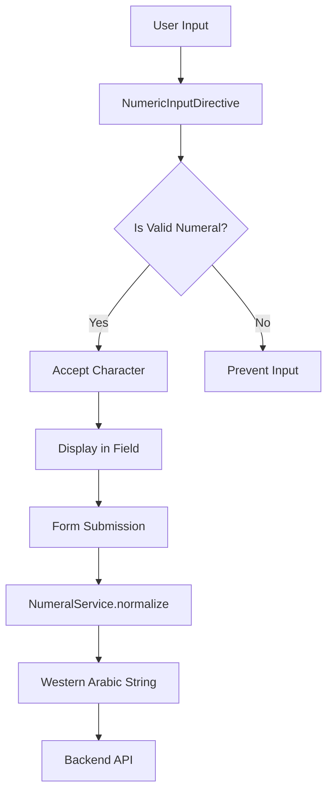

# Design Document: Dari/Pashto Number Input Support

## Overview

This design enables the application to accept Eastern Arabic numerals (۰۱۲۳۴۵۶۷۸۹) in addition to Western Arabic numerals (0123456789) in all numeric input fields. The solution involves creating a shared Angular directive that validates input, normalizes numerals for backend submission, and replaces the existing duplicated `onlyNumberKey` functions throughout the codebase.

## Architecture

The solution follows Angular's directive-based approach for cross-cutting input handling concerns:



### Key Design Decisions

1. **Directive over Component**: Using a directive allows applying numeric validation to any existing input element without changing the component structure.

2. **Text Input Type**: HTML `<input type="number">` does not support non-ASCII digits. All numeric fields will use `type="text"` with directive-based validation.

3. **Normalization at Submission**: Eastern Arabic numerals are converted to Western Arabic only when data is sent to the backend, preserving the user's input display.

4. **Shared Module Export**: The directive and service are exported from SharedModule for application-wide availability.

## Components and Interfaces

### NumericInputDirective

An Angular directive that handles keypress events to validate numeric input.

```typescript
// numeric-input.directive.ts
import { Directive, HostListener, Input, ElementRef } from '@angular/core';

@Directive({
  selector: '[appNumericInput]'
})
export class NumericInputDirective {
  @Input() allowDecimal: boolean = false;
  @Input() allowNegative: boolean = false;

  // Eastern Arabic numerals: ۰۱۲۳۴۵۶۷۸۹
  // Western Arabic numerals: 0123456789
  private readonly easternArabicNumerals = '۰۱۲۳۴۵۶۷۸۹';
  private readonly westernArabicNumerals = '0123456789';
  private readonly decimalPoints = '.٫';
  private readonly negativeSign = '-';

  constructor(private el: ElementRef) {}

  @HostListener('keypress', ['$event'])
  onKeyPress(event: KeyboardEvent): void {
    const char = event.key;
    
    if (!this.isValidChar(char)) {
      event.preventDefault();
    }
  }

  @HostListener('paste', ['$event'])
  onPaste(event: ClipboardEvent): void {
    const pastedText = event.clipboardData?.getData('text') || '';
    if (!this.isValidString(pastedText)) {
      event.preventDefault();
    }
  }

  private isValidChar(char: string): boolean {
    // Allow control keys
    if (char.length > 1) return true;
    
    // Allow numerals (both Eastern and Western Arabic)
    if (this.easternArabicNumerals.includes(char) || 
        this.westernArabicNumerals.includes(char)) {
      return true;
    }
    
    // Allow decimal point if enabled
    if (this.allowDecimal && this.decimalPoints.includes(char)) {
      const currentValue = this.el.nativeElement.value;
      // Only allow one decimal point
      return !currentValue.includes('.') && !currentValue.includes('٫');
    }
    
    // Allow negative sign if enabled (only at start)
    if (this.allowNegative && char === this.negativeSign) {
      const currentValue = this.el.nativeElement.value;
      const selectionStart = this.el.nativeElement.selectionStart;
      return selectionStart === 0 && !currentValue.includes('-');
    }
    
    return false;
  }

  private isValidString(str: string): boolean {
    for (const char of str) {
      if (!this.isValidChar(char)) {
        return false;
      }
    }
    return true;
  }
}
```

### NumeralService

A service that provides numeral conversion utilities.

```typescript
// numeral.service.ts
import { Injectable } from '@angular/core';

@Injectable({
  providedIn: 'root'
})
export class NumeralService {
  private readonly easternToWesternMap: Map<string, string> = new Map([
    ['۰', '0'], ['۱', '1'], ['۲', '2'], ['۳', '3'], ['۴', '4'],
    ['۵', '5'], ['۶', '6'], ['۷', '7'], ['۸', '8'], ['۹', '9'],
    ['٫', '.']  // Persian decimal separator
  ]);

  private readonly westernToEasternMap: Map<string, string> = new Map([
    ['0', '۰'], ['1', '۱'], ['2', '۲'], ['3', '۳'], ['4', '۴'],
    ['5', '۵'], ['6', '۶'], ['7', '۷'], ['8', '۸'], ['9', '۹'],
    ['.', '٫']
  ]);

  /**
   * Converts Eastern Arabic numerals to Western Arabic numerals
   * @param input String potentially containing Eastern Arabic numerals
   * @returns String with all numerals converted to Western Arabic
   */
  toWesternArabic(input: string | number | null | undefined): string {
    if (input === null || input === undefined) return '';
    const str = String(input);
    
    let result = '';
    for (const char of str) {
      result += this.easternToWesternMap.get(char) ?? char;
    }
    return result;
  }

  /**
   * Converts Western Arabic numerals to Eastern Arabic numerals
   * @param input String containing Western Arabic numerals
   * @returns String with all numerals converted to Eastern Arabic
   */
  toEasternArabic(input: string | number | null | undefined): string {
    if (input === null || input === undefined) return '';
    const str = String(input);
    
    let result = '';
    for (const char of str) {
      result += this.westernToEasternMap.get(char) ?? char;
    }
    return result;
  }

  /**
   * Parses a numeric string that may contain Eastern or Western Arabic numerals
   * @param input String to parse
   * @returns Parsed number or NaN if invalid
   */
  parseNumber(input: string | null | undefined): number {
    if (!input) return NaN;
    const normalized = this.toWesternArabic(input);
    return parseFloat(normalized);
  }

  /**
   * Checks if a character is a valid numeral (Eastern or Western Arabic)
   * @param char Single character to check
   * @returns true if the character is a valid numeral
   */
  isNumeral(char: string): boolean {
    return this.easternToWesternMap.has(char) || 
           (char >= '0' && char <= '9');
  }
}
```

### Integration with Forms

Components will use the directive and service together:

```html
<!-- Example usage in template -->
<input type="text" 
       formControlName="amount" 
       appNumericInput 
       [allowDecimal]="true"
       placeholder="مبلغ را وارد کنید">
```

```typescript
// Example usage in component for form submission
onSubmit() {
  const formValue = this.form.value;
  
  // Normalize all numeric fields before submission
  const normalizedData = {
    ...formValue,
    amount: this.numeralService.toWesternArabic(formValue.amount),
    quantity: this.numeralService.toWesternArabic(formValue.quantity)
  };
  
  this.api.submit(normalizedData).subscribe();
}
```

## Data Models

No new data models are required. The solution operates on string transformations at the presentation layer.

### Character Mapping Table

| Eastern Arabic | Western Arabic | Unicode |
|---------------|----------------|---------|
| ۰ | 0 | U+06F0 |
| ۱ | 1 | U+06F1 |
| ۲ | 2 | U+06F2 |
| ۳ | 3 | U+06F3 |
| ۴ | 4 | U+06F4 |
| ۵ | 5 | U+06F5 |
| ۶ | 6 | U+06F6 |
| ۷ | 7 | U+06F7 |
| ۸ | 8 | U+06F8 |
| ۹ | 9 | U+06F9 |
| ٫ | . | U+066B |

## Correctness Properties

*A property is a characteristic or behavior that should hold true across all valid executions of a system—essentially, a formal statement about what the system should do. Properties serve as the bridge between human-readable specifications and machine-verifiable correctness guarantees.*

### Property 1: Valid Numeral Acceptance

*For any* character that is either an Eastern Arabic numeral (۰-۹) or a Western Arabic numeral (0-9), the NumericInputDirective SHALL accept the character and allow it to be entered in the input field.

**Validates: Requirements 1.1, 1.2, 5.1**

### Property 2: Invalid Character Rejection

*For any* character that is not a numeral (Eastern or Western Arabic), decimal point (when allowed), or negative sign (when allowed at position 0), the NumericInputDirective SHALL prevent the character from being entered.

**Validates: Requirements 1.3**

### Property 3: Numeral Normalization Preserves Value

*For any* string containing Eastern Arabic numerals, Western Arabic numerals, or a mix of both, converting to Western Arabic numerals and parsing as a number SHALL produce the same numeric value as the original string represents.

**Validates: Requirements 2.1, 2.3, 5.2**

## Error Handling

| Scenario | Handling |
|----------|----------|
| Invalid character typed | Silently prevent input (no error message) |
| Invalid paste content | Prevent paste operation |
| Null/undefined input to NumeralService | Return empty string |
| Non-numeric string to parseNumber | Return NaN |

## Testing Strategy

### Unit Tests

Unit tests will verify specific examples and edge cases:

1. **NumeralService.toWesternArabic**
   - Empty string returns empty string
   - Null/undefined returns empty string
   - Pure Eastern Arabic string converts correctly
   - Pure Western Arabic string unchanged
   - Mixed string converts correctly
   - String with non-numeric characters preserves them

2. **NumeralService.toEasternArabic**
   - Reverse conversion tests

3. **NumeralService.parseNumber**
   - Parses Eastern Arabic numerals
   - Parses Western Arabic numerals
   - Parses mixed numerals
   - Returns NaN for invalid input

4. **NumericInputDirective**
   - Accepts Eastern Arabic numerals
   - Accepts Western Arabic numerals
   - Rejects alphabetic characters
   - Rejects special characters
   - Handles decimal point based on configuration
   - Handles negative sign based on configuration

### Property-Based Tests

Property-based tests will use a testing library (e.g., fast-check) to verify universal properties:

1. **Property 1 Test**: Generate random valid numerals and verify acceptance
2. **Property 2 Test**: Generate random non-numeric characters and verify rejection
3. **Property 3 Test**: Generate random numeric strings and verify normalization preserves value

Each property test should run minimum 100 iterations.

**Testing Framework**: Jasmine with fast-check for property-based testing

**Tag Format**: `Feature: dari-pashto-numbers, Property N: [property description]`
