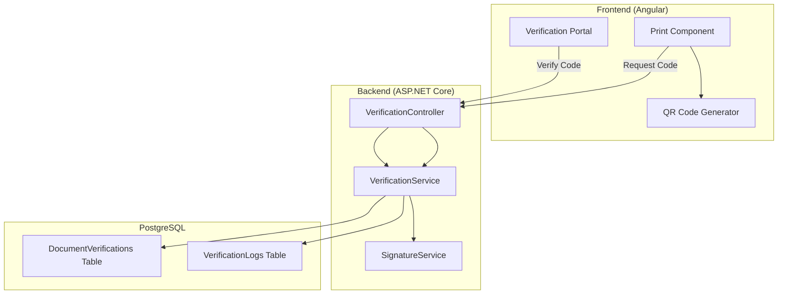

# Design Document: Document Verification System

## Overview

The Document Verification System provides a secure mechanism to authenticate printed licenses and documents in the PRMIS application. It generates unique verification codes and QR codes that link to a public verification portal, allowing anyone to confirm document authenticity.

The system uses a combination of:
- Unique verification codes with a structured format
- HMAC-SHA256 digital signatures for tamper detection
- QR codes for easy mobile scanning
- A public verification portal for document lookup

## Architecture



## Components and Interfaces

### Backend Components

#### 1. VerificationService

Core service for managing verification codes and document verification.

```csharp
public interface IVerificationService
{
    Task<VerificationResult> GetOrCreateVerificationAsync(int documentId, string documentType, string userId);
    Task<DocumentVerificationDto> VerifyDocumentAsync(string verificationCode, string ipAddress);
    Task<bool> RevokeVerificationAsync(string verificationCode, string reason, string userId);
    Task<VerificationStatsDto> GetVerificationStatsAsync(string verificationCode);
}

public class VerificationResult
{
    public string VerificationCode { get; set; }
    public string VerificationUrl { get; set; }
    public bool IsNew { get; set; }
}

public class DocumentVerificationDto
{
    public bool IsValid { get; set; }
    public string Status { get; set; } // Valid, Invalid, Expired, Revoked
    public string VerificationCode { get; set; }
    public string DocumentType { get; set; }
    public string LicenseNumber { get; set; }
    public string HolderName { get; set; }
    public string HolderPhoto { get; set; }
    public DateTime? IssueDate { get; set; }
    public DateTime? ExpiryDate { get; set; }
    public string RevokedReason { get; set; }
    public DateTime VerifiedAt { get; set; }
}
```

#### 2. SignatureService

Handles cryptographic signature generation and verification.

```csharp
public interface ISignatureService
{
    string GenerateSignature(DocumentSignatureData data);
    bool VerifySignature(DocumentSignatureData data, string storedSignature);
}

public class DocumentSignatureData
{
    public string LicenseNumber { get; set; }
    public string HolderName { get; set; }
    public DateTime? IssueDate { get; set; }
    public DateTime? ExpiryDate { get; set; }
}
```

#### 3. VerificationCodeGenerator

Generates unique verification codes with the specified format.

```csharp
public interface IVerificationCodeGenerator
{
    string GenerateCode(string documentTypePrefix);
    bool ValidateCodeFormat(string code);
}
```

### Frontend Components

#### 1. QR Code Service

Angular service for generating QR codes client-side.

```typescript
interface QrCodeService {
  generateQrCode(verificationUrl: string): Promise<string>; // Returns base64 data URL
}
```

#### 2. Verification Portal Component

Public-facing component for document verification.

```typescript
interface VerificationResult {
  isValid: boolean;
  status: 'Valid' | 'Invalid' | 'Expired' | 'Revoked';
  verificationCode: string;
  documentType: string;
  licenseNumber: string;
  holderName: string;
  holderPhoto: string;
  issueDate: Date;
  expiryDate: Date;
  revokedReason?: string;
  verifiedAt: Date;
}
```

### API Endpoints

| Method | Endpoint | Description | Auth Required |
|--------|----------|-------------|---------------|
| POST | `/api/verification/generate` | Generate/retrieve verification code | Yes |
| GET | `/api/verification/verify/{code}` | Verify a document (public) | No |
| POST | `/api/verification/revoke` | Revoke a verification code | Yes (Admin) |
| GET | `/api/verification/stats/{code}` | Get verification statistics | Yes |

## Data Models

### DocumentVerification Entity

```csharp
[Table("DocumentVerifications", Schema = "org")]
public class DocumentVerification
{
    [Key]
    public int Id { get; set; }
    
    [Required]
    [MaxLength(20)]
    public string VerificationCode { get; set; }
    
    [Required]
    public int DocumentId { get; set; }
    
    [Required]
    [MaxLength(50)]
    public string DocumentType { get; set; }
    
    [Required]
    [MaxLength(128)]
    public string DigitalSignature { get; set; }
    
    // Snapshot of key document data at time of generation
    [Column(TypeName = "jsonb")]
    public string DocumentSnapshot { get; set; }
    
    public DateTime CreatedAt { get; set; }
    
    [MaxLength(50)]
    public string CreatedBy { get; set; }
    
    public bool IsRevoked { get; set; }
    public DateTime? RevokedAt { get; set; }
    
    [MaxLength(50)]
    public string RevokedBy { get; set; }
    
    [MaxLength(500)]
    public string RevokedReason { get; set; }
}
```

### VerificationLog Entity

```csharp
[Table("VerificationLogs", Schema = "org")]
public class VerificationLog
{
    [Key]
    public int Id { get; set; }
    
    [Required]
    [MaxLength(20)]
    public string VerificationCode { get; set; }
    
    public DateTime AttemptedAt { get; set; }
    
    [MaxLength(45)]
    public string IpAddress { get; set; }
    
    public bool WasSuccessful { get; set; }
    
    [MaxLength(50)]
    public string FailureReason { get; set; }
}
```

### Database Indexes

```sql
-- Unique index on verification code
CREATE UNIQUE INDEX IX_DocumentVerifications_VerificationCode 
ON org.DocumentVerifications(VerificationCode);

-- Composite index for document lookup
CREATE INDEX IX_DocumentVerifications_DocumentId_DocumentType 
ON org.DocumentVerifications(DocumentId, DocumentType);

-- Index for verification logs
CREATE INDEX IX_VerificationLogs_VerificationCode_AttemptedAt 
ON org.VerificationLogs(VerificationCode, AttemptedAt DESC);
```


## Correctness Properties

*A property is a characteristic or behavior that should hold true across all valid executions of a system—essentially, a formal statement about what the system should do. Properties serve as the bridge between human-readable specifications and machine-verifiable correctness guarantees.*

### Property 1: Verification Code Format Consistency

*For any* document type and generation request, the generated Verification_Code SHALL match the format `{PREFIX}-{YEAR}-{6_ALPHANUMERIC}` where PREFIX is 3 uppercase letters, YEAR is 4 digits, and the random portion is exactly 6 alphanumeric characters.

**Validates: Requirements 1.1**

### Property 2: Verification Code Uniqueness

*For any* set of generated verification codes, no two codes SHALL be identical. This includes codes generated for different documents and codes generated at different times.

**Validates: Requirements 1.2, 7.2**

### Property 3: Verification Code Idempotency

*For any* document that already has a verification code, calling GetOrCreateVerification multiple times SHALL return the same verification code each time.

**Validates: Requirements 1.4**

### Property 4: Digital Signature Round-Trip

*For any* document data, generating a signature and then verifying it with the same data SHALL always succeed. Conversely, verifying with modified data SHALL always fail.

**Validates: Requirements 2.1, 2.3, 2.4**

### Property 5: Verification Data Persistence

*For any* generated verification code, the database record SHALL contain all required fields: DocumentId, DocumentType, DigitalSignature, CreatedAt, and CreatedBy.

**Validates: Requirements 1.3, 2.2**

### Property 6: QR Code URL Encoding

*For any* verification code, the generated QR code SHALL decode to a URL matching the pattern `{BASE_URL}/verify/{VERIFICATION_CODE}`.

**Validates: Requirements 3.1, 3.2**

### Property 7: Valid Code Verification Returns Document Data

*For any* valid, non-revoked, non-expired verification code, the verification endpoint SHALL return IsValid=true and include all document details (license number, holder name, dates, photo).

**Validates: Requirements 4.1**

### Property 8: Invalid Code Verification Returns Error

*For any* verification code that does not exist in the database, the verification endpoint SHALL return IsValid=false with status "Invalid".

**Validates: Requirements 4.2**

### Property 9: Expired Document Status

*For any* document where the current date is after the expiry date, verification SHALL return status "Expired" regardless of other factors.

**Validates: Requirements 4.5**

### Property 10: Verification Audit Logging

*For any* verification attempt (successful or failed), a log entry SHALL be created containing the verification code, timestamp, IP address, and result.

**Validates: Requirements 5.1**

### Property 11: Document Snapshot JSON Round-Trip

*For any* document snapshot stored in the database, deserializing and re-serializing the JSON SHALL produce equivalent data.

**Validates: Requirements 7.4**

### Property 12: Revocation State Persistence

*For any* revoked verification code, the database record SHALL have IsRevoked=true, RevokedAt set to a valid timestamp, and RevokedReason containing the provided reason.

**Validates: Requirements 8.1**

### Property 13: Revoked Document Verification Status

*For any* revoked verification code, the verification endpoint SHALL return status "Revoked" with the revocation reason.

**Validates: Requirements 8.2**

## Error Handling

### Backend Error Handling

| Error Scenario | HTTP Status | Response |
|----------------|-------------|----------|
| Invalid verification code format | 400 Bad Request | `{ "error": "Invalid verification code format" }` |
| Verification code not found | 404 Not Found | `{ "error": "Document not found" }` |
| Database connection failure | 503 Service Unavailable | `{ "error": "Service temporarily unavailable" }` |
| Signature generation failure | 500 Internal Server Error | `{ "error": "Failed to generate verification" }` |
| Unauthorized revocation attempt | 403 Forbidden | `{ "error": "Insufficient permissions" }` |

### Frontend Error Handling

- Display user-friendly error messages in Dari/Pashto
- Show loading states during API calls
- Provide retry options for transient failures
- Log errors to console for debugging

## Testing Strategy

### Unit Tests

Unit tests will cover:
- Verification code format validation
- Signature generation with known inputs
- Date comparison logic for expiry checking
- JSON serialization/deserialization

### Property-Based Tests

Property-based tests will use **FsCheck** for C# backend testing with minimum 100 iterations per property.

Each property test will be tagged with:
- **Feature: document-verification, Property {number}: {property_text}**

Property tests will cover:
- Code generation format consistency (Property 1)
- Code uniqueness across many generations (Property 2)
- Idempotency of code retrieval (Property 3)
- Signature round-trip verification (Property 4)
- QR code URL encoding (Property 6)
- Verification result correctness (Properties 7, 8, 9, 13)

### Integration Tests

Integration tests will verify:
- End-to-end verification flow
- Database persistence
- API endpoint accessibility
- Public portal access without authentication

### Test Data Generators

```csharp
// Generator for valid document data
public static Arbitrary<DocumentSignatureData> ValidDocumentData() =>
    (from licenseNumber in Arb.Generate<NonEmptyString>()
     from holderName in Arb.Generate<NonEmptyString>()
     from issueDate in Gen.Choose(2020, 2030).Select(y => new DateTime(y, 1, 1))
     from expiryDate in Gen.Choose(2025, 2035).Select(y => new DateTime(y, 12, 31))
     select new DocumentSignatureData
     {
         LicenseNumber = licenseNumber.Get,
         HolderName = holderName.Get,
         IssueDate = issueDate,
         ExpiryDate = expiryDate
     }).ToArbitrary();
```
