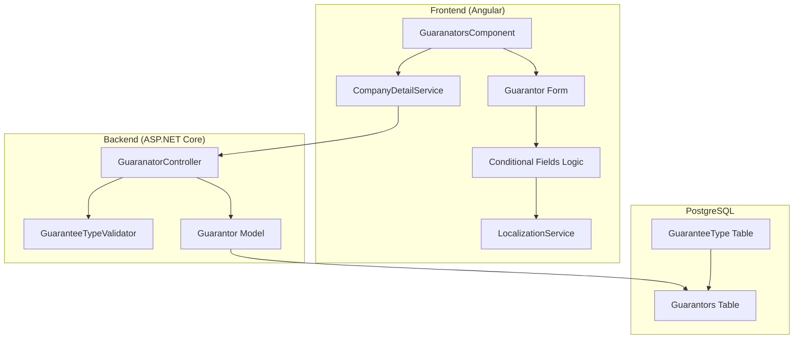
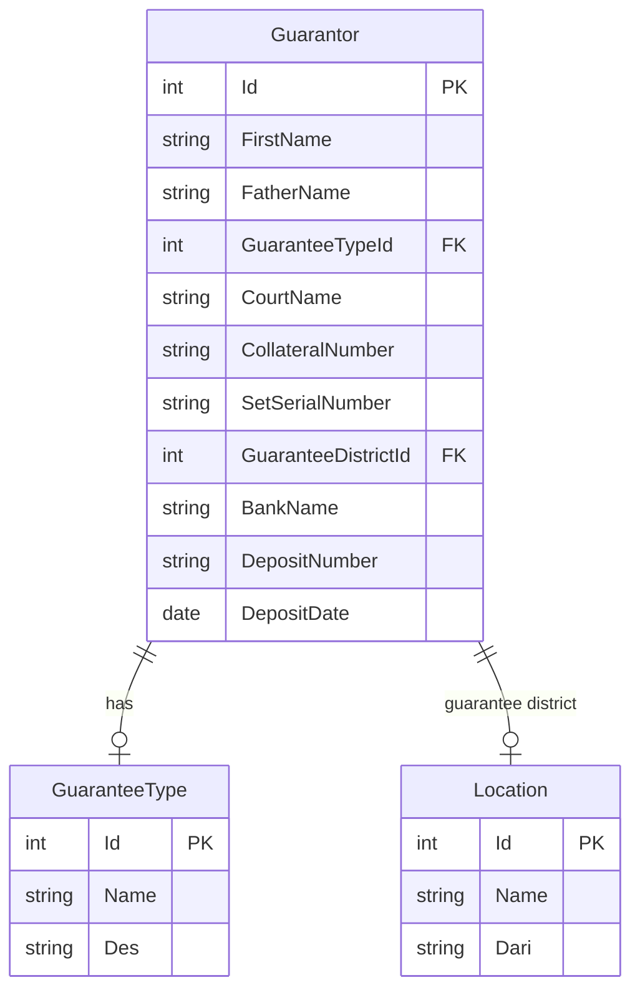

# Design Document: Guarantee Type Logic Enhancement

## Overview

This design document describes the implementation of dynamic conditional fields for the Guarantors (تضمین‌کنندگان) section based on the selected Guarantee Type (نوعیت تضمین). The system will standardize the guarantee type dropdown to three options and dynamically show/hide relevant fields based on the selection.

The implementation follows the existing patterns in the codebase, using Angular reactive forms for the frontend, ASP.NET Core Web API for the backend, and Entity Framework Core with PostgreSQL for data persistence.

## Architecture



## Components and Interfaces

### Frontend Components

#### 1. GuaranatorsComponent Enhancement

The existing `guaranators.component.ts` will be enhanced with:

```typescript
// Guarantee Type Constants
enum GuaranteeTypeEnum {
  Cash = 1,        // پول نقد
  ShariaDeed = 2,  // قباله شرعی
  CustomaryDeed = 3 // قباله عرفی
}

// New form controls for conditional fields
interface ConditionalFieldsConfig {
  // Sharia Deed fields
  courtName: string;           // محکمه نوم
  collateralNumber: string;    // نمبر وثیقه
  
  // Customary Deed fields
  setSerialNumber: string;     // نمبر سریال سټه
  districtId: number;          // ناحیه
  
  // Cash fields
  bankName: string;            // بانک
  depositNumber: string;       // نمبر اویز
  depositDate: string;         // تاریخ اویز
}

// Method to handle guarantee type change
onGuaranteeTypeChange(guaranteeTypeId: number): void {
  // Clear all conditional fields
  // Show/hide fields based on selection
  // Update validators dynamically
}
```

#### 2. LocalizationService Update

Add new guarantee type mappings:

```typescript
guaranteeTypes = [
  { value: 'Cash', label: 'پول نقد', id: 1 },
  { value: 'ShariaDeed', label: 'قباله شرعی', id: 2 },
  { value: 'CustomaryDeed', label: 'قباله عرفی', id: 3 }
];
```

### Backend Components

#### 1. Guarantor Model Extension

```csharp
public partial class Guarantor
{
    // Existing fields...
    
    // Sharia Deed fields
    public string? CourtName { get; set; }           // محکمه نوم
    public string? CollateralNumber { get; set; }    // نمبر وثیقه
    
    // Customary Deed fields
    public string? SetSerialNumber { get; set; }     // نمبر سریال سټه
    public int? GuaranteeDistrictId { get; set; }    // ناحیه
    
    // Cash fields
    public string? BankName { get; set; }            // بانک
    public string? DepositNumber { get; set; }       // نمبر اویز
    public DateOnly? DepositDate { get; set; }       // تاریخ اویز
    
    // Navigation property
    public virtual Location? GuaranteeDistrict { get; set; }
}
```

#### 2. GuarantorData Request Model Extension

```csharp
public class GuarantorData
{
    // Existing fields...
    
    // Sharia Deed fields
    public string? CourtName { get; set; }
    public string? CollateralNumber { get; set; }
    
    // Customary Deed fields
    public string? SetSerialNumber { get; set; }
    public int? GuaranteeDistrictId { get; set; }
    
    // Cash fields
    public string? BankName { get; set; }
    public string? DepositNumber { get; set; }
    public string? DepositDate { get; set; }
}
```

#### 3. GuaranatorController Validation Logic

```csharp
private ValidationResult ValidateGuaranteeFields(GuarantorData request)
{
    switch (request.GuaranteeTypeId)
    {
        case 1: // Cash
            if (string.IsNullOrEmpty(request.BankName) ||
                string.IsNullOrEmpty(request.DepositNumber) ||
                string.IsNullOrEmpty(request.DepositDate))
            {
                return ValidationResult.Failure("Cash guarantee requires bank name, deposit number, and deposit date");
            }
            break;
            
        case 2: // Sharia Deed
            if (string.IsNullOrEmpty(request.CourtName) ||
                string.IsNullOrEmpty(request.CollateralNumber))
            {
                return ValidationResult.Failure("Sharia deed requires court name and collateral number");
            }
            break;
            
        case 3: // Customary Deed
            if (string.IsNullOrEmpty(request.SetSerialNumber) ||
                !request.GuaranteeDistrictId.HasValue)
            {
                return ValidationResult.Failure("Customary deed requires set serial number and district");
            }
            break;
    }
    return ValidationResult.Success();
}
```

## Data Models

### Database Schema Changes

```sql
-- Add new columns to Guarantors table
ALTER TABLE org."Guarantors" ADD COLUMN "CourtName" VARCHAR(255) NULL;
ALTER TABLE org."Guarantors" ADD COLUMN "CollateralNumber" VARCHAR(100) NULL;
ALTER TABLE org."Guarantors" ADD COLUMN "SetSerialNumber" VARCHAR(100) NULL;
ALTER TABLE org."Guarantors" ADD COLUMN "GuaranteeDistrictId" INTEGER NULL;
ALTER TABLE org."Guarantors" ADD COLUMN "BankName" VARCHAR(255) NULL;
ALTER TABLE org."Guarantors" ADD COLUMN "DepositNumber" VARCHAR(100) NULL;
ALTER TABLE org."Guarantors" ADD COLUMN "DepositDate" DATE NULL;

-- Add foreign key for district
ALTER TABLE org."Guarantors" 
ADD CONSTRAINT "FK_Guarantors_GuaranteeDistrict" 
FOREIGN KEY ("GuaranteeDistrictId") 
REFERENCES look."Location"("Id");

-- Update GuaranteeType lookup table
DELETE FROM look."GuaranteeType";
INSERT INTO look."GuaranteeType" ("Id", "Name", "Des") VALUES
(1, 'Cash', 'پول نقد'),
(2, 'ShariaDeed', 'قباله شرعی'),
(3, 'CustomaryDeed', 'قباله عرفی');
```

### Entity Relationship Diagram



### Frontend Form State Model

```typescript
interface GuarantorFormState {
  guaranteeTypeId: number | null;
  
  // Visibility flags
  showShariaDeedFields: boolean;
  showCustomaryDeedFields: boolean;
  showCashFields: boolean;
  
  // Field values
  courtName: string;
  collateralNumber: string;
  setSerialNumber: string;
  guaranteeDistrictId: number | null;
  bankName: string;
  depositNumber: string;
  depositDate: string;
}
```


## Correctness Properties

*A property is a characteristic or behavior that should hold true across all valid executions of a system—essentially, a formal statement about what the system should do. Properties serve as the bridge between human-readable specifications and machine-verifiable correctness guarantees.*

### Property 1: Guarantee Type Validation

*For any* guarantor submission, the guarantee type ID must be one of the three valid values (1=Cash, 2=ShariaDeed, 3=CustomaryDeed), and the guarantee type field must not be null or empty.

**Validates: Requirements 1.4, 8.1**

### Property 2: Sharia Deed Field Validation

*For any* guarantor submission where guarantee type is ShariaDeed (ID=2), the submission should be rejected if either Court Name or Collateral Number is missing or empty.

**Validates: Requirements 2.3, 5.1**

### Property 3: Customary Deed Field Validation

*For any* guarantor submission where guarantee type is CustomaryDeed (ID=3), the submission should be rejected if either Set Serial Number or District/Zone is missing or empty.

**Validates: Requirements 3.3, 5.2**

### Property 4: Cash Field Validation

*For any* guarantor submission where guarantee type is Cash (ID=1), the submission should be rejected if any of Bank Name, Deposit Number, or Deposit Date is missing or empty.

**Validates: Requirements 4.4, 5.3**

### Property 5: Relevant Fields Storage

*For any* successfully saved guarantor record, only the fields relevant to the selected guarantee type should have non-null values, and fields for other guarantee types should be null.

**Validates: Requirements 5.4, 5.5**

### Property 6: View/Print Field Visibility

*For any* guarantor record displayed in view or print mode, only the fields relevant to the stored guarantee type should be visible, and all other conditional fields should be hidden.

**Validates: Requirements 7.1, 7.3, 7.4**

### Property 7: Edit Mode Field Loading

*For any* existing guarantor record loaded for editing, the conditional fields displayed should match the stored guarantee type, and the field values should be correctly populated.

**Validates: Requirements 8.5**

### Property 8: Conditional Validation Scope

*For any* form validation, conditional fields should only be validated when their parent guarantee type is selected; fields for non-selected types should not trigger validation errors.

**Validates: Requirements 8.3**

## Error Handling

### Frontend Error Handling

| Error Condition | User Message (Dari) | Behavior |
|----------------|---------------------|----------|
| Guarantee type not selected | نوعیت تضمین الزامی است | Prevent form submission, highlight field |
| Sharia Deed: Court Name missing | محکمه نوم الزامی است | Prevent form submission, highlight field |
| Sharia Deed: Collateral Number missing | نمبر وثیقه الزامی است | Prevent form submission, highlight field |
| Customary Deed: Set Serial Number missing | نمبر سریال سټه الزامی است | Prevent form submission, highlight field |
| Customary Deed: District missing | ناحیه الزامی است | Prevent form submission, highlight field |
| Cash: Bank Name missing | بانک الزامی است | Prevent form submission, highlight field |
| Cash: Deposit Number missing | نمبر اویز الزامی است | Prevent form submission, highlight field |
| Cash: Deposit Date missing | تاریخ اویز الزامی است | Prevent form submission, highlight field |
| API error | خطا در ذخیره معلومات | Display toast error message |

### Backend Error Handling

| Error Condition | HTTP Status | Response Message |
|----------------|-------------|------------------|
| Invalid guarantee type ID | 400 Bad Request | "Invalid guarantee type" |
| Missing required fields for type | 400 Bad Request | "Required fields missing for selected guarantee type" |
| Database constraint violation | 500 Internal Server Error | "Internal server error" |
| Unauthorized access | 401 Unauthorized | "Unauthorized" |

### Error Recovery Strategy

1. **Frontend Validation First**: All validation errors are caught at the frontend before API calls
2. **Backend Validation Backup**: Backend validates all data even if frontend validation passes
3. **Transaction Rollback**: Database operations use transactions to ensure atomicity
4. **Audit Trail**: All changes are logged in the audit table for recovery purposes

## Testing Strategy

### Unit Tests

Unit tests will cover specific examples and edge cases:

1. **Dropdown Options Test**: Verify exactly 3 guarantee types are displayed
2. **Field Visibility Tests**: Test each guarantee type shows correct fields
3. **Field Clearing Tests**: Test fields are cleared when switching types
4. **Validation Message Tests**: Test correct Dari error messages are displayed
5. **Date Picker Integration**: Test multi-calendar date picker works for deposit date

### Property-Based Tests

Property-based tests will use a testing library (e.g., FsCheck for C# backend, fast-check for TypeScript frontend) to verify universal properties across many generated inputs.

**Configuration**: Each property test will run minimum 100 iterations.

**Test Annotations**: Each test will be tagged with:
- Feature: guarantee-type-logic
- Property number and title
- Requirements reference

#### Backend Property Tests (C# with FsCheck)

```csharp
// Property 1: Guarantee Type Validation
[Property]
public Property GuaranteeTypeValidation_OnlyValidTypesAccepted()
{
    return Prop.ForAll(
        Arb.From<int>(),
        guaranteeTypeId =>
        {
            var isValid = guaranteeTypeId >= 1 && guaranteeTypeId <= 3;
            var result = ValidateGuaranteeType(guaranteeTypeId);
            return result.IsValid == isValid;
        });
}

// Property 2: Sharia Deed Field Validation
[Property]
public Property ShariaDeedValidation_RequiresBothFields()
{
    return Prop.ForAll(
        Arb.From<string>().Filter(s => s != null),
        Arb.From<string>().Filter(s => s != null),
        (courtName, collateralNumber) =>
        {
            var request = new GuarantorData
            {
                GuaranteeTypeId = 2,
                CourtName = courtName,
                CollateralNumber = collateralNumber
            };
            var result = ValidateGuaranteeFields(request);
            var bothPresent = !string.IsNullOrWhiteSpace(courtName) && 
                              !string.IsNullOrWhiteSpace(collateralNumber);
            return result.IsValid == bothPresent;
        });
}
```

#### Frontend Property Tests (TypeScript with fast-check)

```typescript
// Property 8: Conditional Validation Scope
fc.assert(
  fc.property(
    fc.integer({ min: 1, max: 3 }),
    fc.record({
      courtName: fc.string(),
      collateralNumber: fc.string(),
      setSerialNumber: fc.string(),
      guaranteeDistrictId: fc.option(fc.integer()),
      bankName: fc.string(),
      depositNumber: fc.string(),
      depositDate: fc.string()
    }),
    (guaranteeTypeId, fields) => {
      const form = createFormWithFields(guaranteeTypeId, fields);
      const errors = validateForm(form);
      
      // Only fields for selected type should have validation errors
      if (guaranteeTypeId === 1) {
        // Cash: only bank, deposit fields should be validated
        expect(errors).not.toContain('courtName');
        expect(errors).not.toContain('setSerialNumber');
      }
      // ... similar for other types
    }
  ),
  { numRuns: 100 }
);
```

### Integration Tests

1. **Full CRUD Flow**: Test create, read, update, delete for each guarantee type
2. **Type Switching**: Test changing guarantee type on existing record
3. **Data Persistence**: Test that correct fields are stored and retrieved
4. **Print Output**: Test print view shows correct fields

### Test Data Generators

```typescript
// Generator for valid Sharia Deed data
const shariaDeedGenerator = fc.record({
  guaranteeTypeId: fc.constant(2),
  courtName: fc.string({ minLength: 1, maxLength: 255 }),
  collateralNumber: fc.string({ minLength: 1, maxLength: 100 })
});

// Generator for valid Customary Deed data
const customaryDeedGenerator = fc.record({
  guaranteeTypeId: fc.constant(3),
  setSerialNumber: fc.string({ minLength: 1, maxLength: 100 }),
  guaranteeDistrictId: fc.integer({ min: 1, max: 1000 })
});

// Generator for valid Cash data
const cashGenerator = fc.record({
  guaranteeTypeId: fc.constant(1),
  bankName: fc.string({ minLength: 1, maxLength: 255 }),
  depositNumber: fc.string({ minLength: 1, maxLength: 100 }),
  depositDate: fc.date().map(d => d.toISOString().split('T')[0])
});
```
